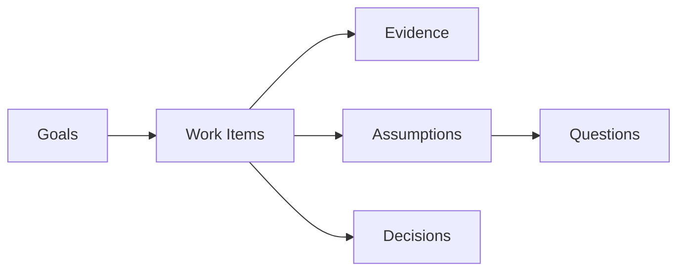

# grove

Graph-driven reasoning over verified evidence. A formal workflow protocol for AI coding agents: deterministic Definition of Ready, falsifiable assumption gates, atomic done-transitions; state lives in a single line-oriented lock file; the agent reads only what the current step demands. Designed to let weak agents go deep without hallucinating.



## Why this exists

AI agents have a self-reporting problem. When you give an agent a task, it tends to declare it done before it actually is, not out of deception, but because nothing in the environment prevents it. Standard task trackers trust the executor. For humans that is a reasonable default. For autonomous agents it is a silent failure mode that compounds across long sessions.

Grove's answer is: **rules written in a prompt are suggestions; rules enforced by the CLI are invariants.** The agent cannot mark a work item done without a falsifiable evidence record. It cannot start work without every precondition machine-verified. It cannot update a goal's progress manually. The delta is applied atomically at close time or not at all.

This means an agent running Grove cannot hallucinate progress. The state file either reflects reality or the CLI refuses to advance.

## Core ideas

- Discovery and Delivery run in parallel [Dual-Track Agile, Cagan]. A work item cannot enter Delivery until every open question and unvalidated assumption that blocks it is resolved in Discovery.
- Every executable unit has explicit acceptance criteria before code is written [HDD, Definition of Ready]. The DoR is not a checklist anyone can override — it is a boolean conjunction the CLI evaluates on every `status=progress` transition.
- Long-lived design choices are first-class artifacts [ADR, Nygard]. Decisions are immutable once accepted. They cannot be quietly revised; they can only be superseded by a new decision with a recorded rationale.
- Open unknowns are first-class artifacts; agents declare them rather than pretend to know [Continuous Discovery; Cynefin]. A question tagged `chaotic` halts the agent and requires human resolution.
- Assumptions are falsifiable gates, not comments. An assumption in state `invalidated_blocking` prevents any dependent work item from becoming ready. The agent cannot proceed by ignoring it.
- Refactoring uses a Mikado-style dependency graph distinguishing causation, sequencing, implementation, and inquiry. This makes the blast radius of a change explicit before the first line is touched.

## What the agent gains

**No context amnesia.** `grove packet W-NN` emits exactly the context needed for the current step: the work item, its acceptance criteria, its open questions, its assumption chain, and the decisions that constrain it. The agent does not need to read the whole state file.

**No ambiguous next step.** `grove next` computes the highest-priority ready work item on the critical path. The agent always knows what to do without reasoning about the full graph.

**No silent goal drift.** Goals carry a fitness metric. When a work item closes, the fitness delta is applied atomically to every linked goal. The health of every goal is always current without a separate update step.

**No parallel conflicts.** Session tokens (I₁₁) ensure that only the session that claimed a work item can mutate it. Two agents cannot race on the same task.

## Core invariants

```text
I₁:  ∀ w ∈ W with status = progress, DoR(w) ≡ ⊤.
I₂:  ∀ w with type = spike ∧ status = done,
      produces(w) ⊆ D ∪ Q ∪ B  ∧  produces(w) ≠ ∅.
I₃:  ∀ w with status = done, ∃ ev ∈ Evidence, satisfies(ev, AC(w)).
I₄:  |{ w ∈ W : status(w) = progress }| ≤ WIP_LIMIT (default 2).
I₅:  ∀ (n₁, blocks, n₂) ∈ E, terminal⁺(n₁) before status(n₂) may transition to progress.
I₆:  ∀ a ∈ A, status(a) = done ⟺ ∀ w ∈ WI(a), status(w) ∈ { done, rejected, archived }.
I₇:  graph (N, E ∩ (· × {blocks} × ·)) is a DAG.
I₈:  ∀ q ∈ Q with cynefin(q) = chaotic, status transitions only via human.
I₉:  ∀ w ∈ W with type = feature, DoR(w) ⇒
      ∀ b ∈ BChain(w), status(b) ∈ { validated, invalidated_acceptable }.
I₁₀: status transition w → done is atomic with applying fitness deltas
      to each g ∈ goals(w) and re-deriving status(g). Either both succeed or
      neither does. The CLI rejects status=done unless deltas are staged
      in the same call (or pre-staged via `grove fitness` since the last
      status mutation of w).
I₁₁: ∀ w ∈ W with status = progress, the session that set it is the only
      session permitted to mutate w until terminal(w) or w leaves `progress`
      (e.g. `revert` or another guarded status change). Persisted as header
      attrs `session` and `session_at` (UTC); `check` rejects a missing token
      (`grove resume` adopts; see protocol §2.6).
```

with terminality:

```text
terminal(w ∈ W)  ⟺ status(w) ∈ { done, rejected, archived }
terminal⁺(g ∈ G) ⟺ status(g) = verified (strict for blocks-edges)
terminal(g ∈ G)  ⟺ status(g) ∈ { verified, declined }
terminal(d ∈ D)  ⟺ status(d) ∈ { accepted, rejected, superseded }
terminal(q ∈ Q)  ⟺ status(q) ∈ { answered, deferred, dropped }
terminal(b ∈ B)  ⟺ status(b) ∈ { validated, invalidated_acceptable, invalidated_blocking }
terminal(a ∈ A)  ⟺ status(a) = done
```

`terminal⁺` is the strict variant used for `blocks` edges: a `declined` goal does not unblock dependents. Other relations use the lax `terminal`.

```text
assumptions(w) ≜ { b ∈ B | (b, targets, w) ∈ E }
BChain(w)      ≜ assumptions(w) ∪ { b ∈ B | ∃ q, (q, asks, w) ∈ E ∧ (b, tests, q) ∈ E }
produces(w)    ≜ { n ∈ D ∪ Q ∪ B | (w, produces, n) ∈ E }
goals(w)       ≜ as recorded in `goals` field of w
WI(a)          ≜ { w ∈ W | theme(w) = a }
```

## Formal model

### Node taxonomy

Development state is the tuple:

```text
Σ ≜ (G, W, D, Q, B, R, A, E)
```

| Set                | Symbol             | Meaning                                                   | ID prefix |
| ------------------ | ------------------ | --------------------------------------------------------- | --------- |
| Goals              | G                  | Outcome / requirement; has fitness function.              | `G-NN`    |
| Work items         | W                  | Executable unit with DoR + DoD.                           | `W-NN`    |
| Decisions          | D                  | ADR; long-lived design choice.                            | `D-NN`    |
| Questions          | Q                  | Open unknown.                                             | `Q-NN`    |
| Assumptions        | B                  | Falsifiable assumption with validation method and result. | `B-NN`    |
| Retrospectives     | R                  | Post-goal learning capture.                               | `R-NN`    |
| Artifacts (themes) | A                  | Grouping of related W (optional).                         | `A-NN`    |
| Edges              | E ⊆ N × LabelE × N | Typed graph edges (§1.3).                                 | –         |

with N ≜ G ∪ W ∪ D ∪ Q ∪ B ∪ R ∪ A.

### Edge labels

```text
LabelE = { blocks, causes, implements, asks, tests, supersedes, produces, targets }
```

| Label        | Domain → Codomain    | Meaning                                                            |
| ------------ | -------------------- | ------------------------------------------------------------------ |
| `blocks`     | N → W                | Predecessor must be terminal before successor may start.           |
| `causes`     | A → W (refactor/bug) | Root cause to symptom.                                             |
| `implements` | W → D                | Work item realises an accepted decision.                           |
| `asks`       | Q → N                | Open question is raised against the target node.                   |
| `tests`      | B → Q                | Assumption operationalises a question into falsifiable validation. |
| `targets`    | B → W                | Assumption is required by a work item (defines `assumptions(w)`).  |
| `produces`   | W → D ∪ Q ∪ B        | Work item (typically a spike) produced this artifact.              |
| `supersedes` | D → D                | New decision replaces the old one.                                 |

The graph (N, E) is acyclic on `blocks`. Cycles on other labels are allowed.

### Status sets

```text
status(g) ∈ { unverified, partial, verified, declined }
status(w) ∈ { proposed, ready, progress, done, rejected, archived }
status(d) ∈ { proposed, accepted, rejected, superseded }
status(q) ∈ { open, deferred, answered, dropped }
status(b) ∈ { proposed, testing, validated, invalidated_acceptable, invalidated_blocking }
status(r) ∈ { draft, final }
status(a) ∈ { open, done }   (derived per I₆; never set manually)
```

### Cynefin tag (mandatory on Q, B, and W)

```text
cynefin(n) ∈ { clear, complicated, complex, chaotic }
```

Drives agent behaviour ([Protocol](skill/protocol.md) §5.2). If `chaotic`, stop and escalate.

## How the state file works

All state lives in `.grove/state.lock`, a single line-oriented text file with a SHA-256 checksum on every write. Any manual edit is detected immediately on the next CLI call and all operations are blocked until the file is repaired. The agent never reads or writes the file directly — only through CLI commands.

This design makes the entire workflow auditable and diff-friendly. Every transition is a single atomic write. The lock file can be committed to version control; its history is the history of the project's reasoning, not just its code.

## Typical CLI session

`grove next` selects the highest-priority ready work item on the critical path. `grove packet` emits the full context the agent needs for that step and nothing more. `grove dor` shows which preconditions are still unsatisfied. `grove check` verifies all invariants and is intended to run as a pre-commit hook. `grove fitness` stages a metric delta against a goal before closing. `grove set status=done` is the atomic terminal transition: it applies all staged deltas, re-derives goal status, and writes a new checksum.

```bash
grove next
grove packet W-12
grove dor W-12
grove check
grove fitness W-12 G-01 +1
grove set W-12 status=done
```

## What it is not

- Not a task manager. Linear / Jira / Taskmaster cover that surface and Grove does not compete on UX.
- Not a code-context tool. Aider, Continue, Cursor handle code maps; Grove handles process state.
- Not a multi-agent orchestrator. Single writer per repo; multi-agent via worktrees + ID striding.

## Install

```bash
git clone https://github.com/alexshelepenok/grove.git ~/.local/grove
echo "alias grove='julia --project=$HOME/.local/grove $HOME/.local/grove/bin/grove.jl'" >> ~/.bashrc
```

Requires Julia 1.10+.

## Influences

Dual-Track Agile (Cagan), Hypothesis-Driven Development, ADRs (Nygard), Continuous Discovery, Cynefin (Snowden), Mikado method. Grove takes the fragments that survive contact with LLM agents and makes them machine-checkable.

## License

MIT License

Copyright (c) 2026 Alexander Shelepenok

Permission is hereby granted, free of charge, to any person obtaining a copy of this software and associated documentation files (the "Software"), to deal in the Software without restriction, including without limitation the rights to use, copy, modify, merge, publish, distribute, sublicense, and/or sell copies of the Software, and to permit persons to whom the Software is furnished to do so, subject to the following conditions:

The above copyright notice and this permission notice shall be included in all copies or substantial portions of the Software.

THE SOFTWARE IS PROVIDED "AS IS", WITHOUT WARRANTY OF ANY KIND, EXPRESS OR IMPLIED, INCLUDING BUT NOT LIMITED TO THE WARRANTIES OF MERCHANTABILITY, FITNESS FOR A PARTICULAR PURPOSE AND NONINFRINGEMENT. IN NO EVENT SHALL THE AUTHORS OR COPYRIGHT HOLDERS BE LIABLE FOR ANY CLAIM, DAMAGES OR OTHER LIABILITY, WHETHER IN AN ACTION OF CONTRACT, TORT OR OTHERWISE, ARISING FROM, OUT OF OR IN CONNECTION WITH THE SOFTWARE OR THE USE OR OTHER DEALINGS IN THE SOFTWARE.