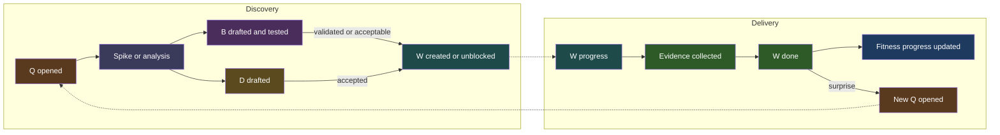

# Dual-track loops

Discovery and Delivery run concurrently, not as phases.

```mermaid
graph LR
  subgraph Discovery
    Q[Q opened]:::question --> S[Spike or analysis]:::spike
    S --> B[B drafted and tested]:::assumption
    S --> D[D drafted]:::decision
    B -->|"validated or acceptable"| W2[W created or unblocked]:::feature
    D -->|accepted| W2
  end

  subgraph Delivery
    W[W progress]:::feature --> Ev[Evidence collected]:::done
    Ev --> Done[W done]:::done
    Done --> Fit[Fitness progress updated]:::goal
    Done -->|surprise| Qnew[New Q opened]:::question
  end

  Qnew -.-> Q
  W2 -.-> W

  classDef question fill:#5a3a1e,color:#fff
  classDef assumption fill:#4a2d5a,color:#fff
  classDef spike fill:#3a3a5a,color:#fff
  classDef decision fill:#5a4a1e,color:#fff
  classDef goal fill:#1e3a5f,color:#fff
  classDef feature fill:#1e4a4a,color:#fff
  classDef done fill:#2d5a27,color:#fff
```
