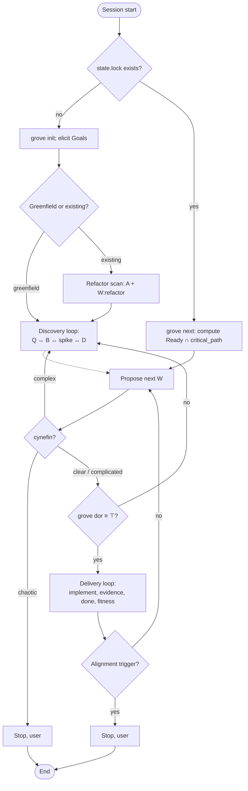

# Top-level session workflow

```mermaid
graph TD
  Start([Session start]) --> HasState{state.lock exists?}
  HasState -->|no| Bootstrap["grove init; elicit Goals"]
  HasState -->|yes| Read["grove next: compute Ready ∩ critical_path"]
  Bootstrap --> Track{Greenfield or existing?}
  Track -->|greenfield| Discovery
  Track -->|existing| Scan["Refactor scan: A + W:refactor"]
  Scan --> Discovery
  Read --> Pick[Propose next W]
  Pick --> Cynefin{cynefin?}
  Cynefin -->|chaotic| Stop["Stop, user"]
  Cynefin -->|complex| Discovery
  Cynefin -->|"clear / complicated"| DoR{"grove dor ≡ ⊤?"}
  DoR -->|no| Discovery
  DoR -->|yes| Delivery
  Discovery["Discovery loop:<br/>Q ↔ B ↔ spike ↔ D"] -.-> Pick
  Delivery["Delivery loop:<br/>implement, evidence, done, fitness"] --> Trigger{Alignment trigger?}
  Trigger -->|yes| Checkpoint["Stop, user"]
  Trigger -->|no| Pick
  Checkpoint --> EndNode([End])
  Stop --> EndNode
```
